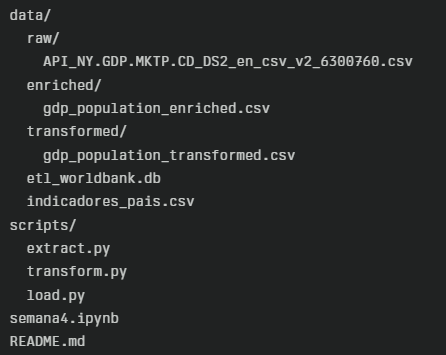

# Projeto ETL: World Bank

## Visão Geral
Este projeto implementa um pipeline ETL (Extract, Transform, Load) para analisar indicadores económicos globais, com foco em PIB, população e PIB per capita, usando dados do Banco Mundial. O objetivo é preparar, transformar e visualizar os dados de forma interativa, facilitando a análise de tendências e comparações entre países.

## Estrutura do Projeto



## Dependências
- Python 3.8+
- sqlite3 (Incluído no Python)
- Bibliotecas:
  - pandas
  - plotly, dash, jupyter-dash (Visualização interativa)
  - requests

Instalação rápida:
```pip install pandas plotly dash jupyter-dash requests```

## Pipeline ETL
### 1. Extração 
- Script: ```scripts/extract.py```
- Entrada: ```data/raw/API_NY.GDP.MKTP.CD_DS2_en_csv_v2_6300760.csv```
- Saída: ```data/enriched/gdp_population_enriched.csv```
- Descrição:
Extrai dados brutos do Banco Mundial e enriquece com população via API.

### 2. Transformação
- Script: ```scripts/transform.py```
- Entrada: ```data/enriched/gdp_population_enriched.csv```
- Saída: ```data/transformed/gdp_population_transformed.csv```
- Descrição:
Limpa os dados, remove valores ausentes e calcula métricas como PIB per capita para cada país e ano.

### 3. Carregamento
- Script: ```scripts/load.py```
- Entrada: ```data/transformed/gdp_population_transformed.csv```
- Saída: ```data/world_bank.db``` (tabela: indicadores_pais)
- Descrição:
Carrega os dados transformados para um banco SQLite, criando a tabela ```indicadores_pais```.

### 4. Visualização
- Notebook: ```semana4.ipynb```
- Entrada: ```data/world_bank.db```
- Descrição:
Cria dashboard interativo com gráficos de linha, barras, dispersão e mapa, usando Plotly Dash.

## Como Executar

1. **Executar o pipeline ETL**: Na raiz do projeto:
   ```bash
   python scripts/extract.py
   python scripts/transform.py
   python scripts/load.py
   ```
2. **Exportar o banco de dados**: O banco de dados SQLite ```data/world_bank.db``` é enviado para o Google Colab.

3. **Visualizar os dados**: Abra o notebook ```semana4.ipynb``` no Google Colab e execute as células para gerar o dashboard interativo.

## Visualizações Criadas
- Gráfico de dispersão: PIB per Capita vs População (2022)
- Mapa mundial: PIB per Capita por país (2022)
- Gráfico de linha: Evolução do PIB per Capita por país (2018-2022)
- Gráfico de barras: População por país (2018-2022)
- Dropdown interativo: Seleção de país para análise detalhada

## Dicionário de Dados
- Country Name: Nome do país
- Country Code: Código ISO do país
- 2018, 2019, ...: PIB (USD) por ano
- Population_2018, ...: População total por ano
- gdp_per_capita_2018, ...: PIB per capita por ano

## Validar o Banco de Dados
No terminal, na raiz do projeto, execute:
```bash
sqlite3.exe data/world_bank.db
```
No prompt do SQLite:
```
.tables
SELECT * FROM indicadores_pais LIMIT 5;
```

## Referências
- [World Bank Open Data](https://data.worldbank.org/)
- [World Bank Indicator API](https://wbdocs.worldbank.org/wbdocs/public/IndicatorAPI.html)
- [Plotly Dash Documentation](https://dash.plotly.com/)

## Autoria 
Projeto realizado por Ana Fernandes (Nº51648) e Sofia Machado (Nº52152) para a disciplina de Extração e Transformação de Dados (ETL), UBI, 2025.
